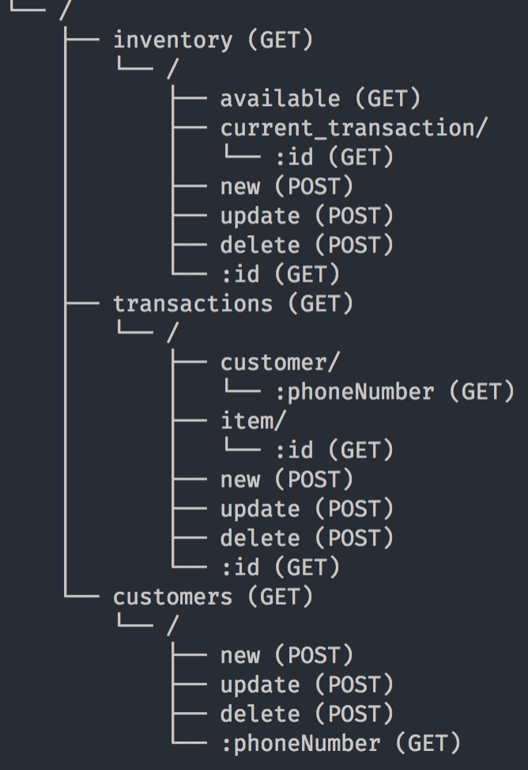
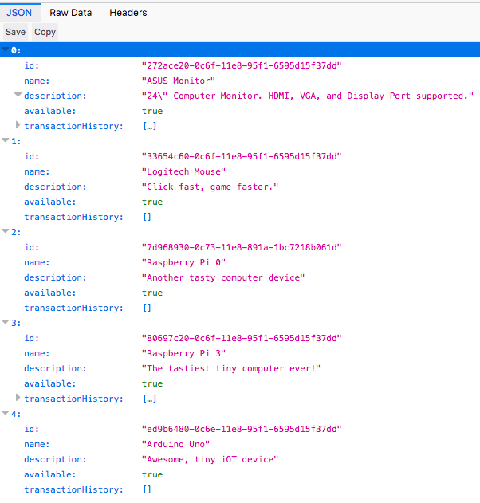
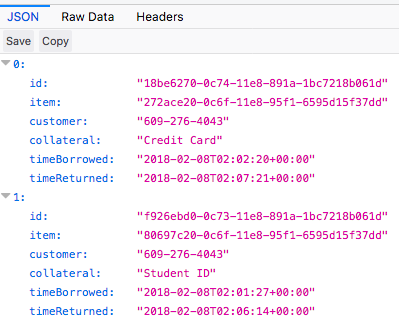
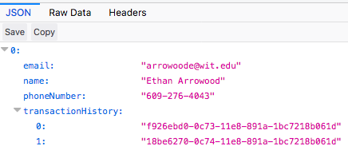
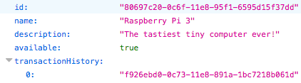
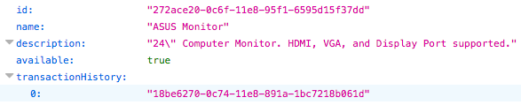

# Demo & Explanations

We created a point-of-borrow API that is very similar to a point-of-sales application. We used `fastify` for our backend API server and `harperDB` for the database. This API follows standard REST API specifications. 

## Endpoints

1. `/inventory`
    
    This endpoint serves all items in the system. There are multiple `GET` and `POST` implementations of this endpoint. 
    
    The most useful is: `POST /inventory/new`. Use this route to add a new inventory item.
    ```
    {
      name: "Apple Computer Charger",
      description: "Super terrible white cable that is probably already breaking."
    }
    ```
    When new inventory items are added using this endpoint, the API does some extra work before shipping it to the database. For one it generates a random ID using `uuid/v1`. Additionally, it adds default properties `available` and `transactionHistory` to the record. 

    An example of an inventory with multiple items looks like so:

    

2. `/transactions`

    This endpoint serves the core functionality of our API. The `POST /transactions/new` request automatically generates new users or appends data to existing users. Used correctly, a client can dramatically simplify their 'checkout' process by just asking for a customers phone number instead of some randomly generated ID. (See the Customer record section below for more details).

    Example usage of `POST /transactions/new` when the customer is new:
    ```
    {
      customer: {
        name: "First Last",
        email: "email@email.com",
        phoneNumber: "123-456-7890"
      },
      item: "long-random-uuid-v1-string",
      collateral: "Student ID"
    }
    ```
    Or when the customer already exists:
    ```
    {
      customer: {
        phoneNumber: "123-456-7890"
      },
      item: "different-uuid-v1-string",
      collateral: "Credit Card"
    }
    ```
    Here are some example transactions that have been returned:

    

    And the user who borrowed the items:

    

    Notice the `transactionHistory` array and the transaction record ids. Similarly, check out the items this user borrowed:

    

3. `/customers`

    The customers endpoint exists but is not necessary for our API. By embedding the customer generation into the new transaction method we can theoretically simplify the checkout procedure in a front-end application built on top of this API.

    An example user timeline functions like so:
    1. User finds item they want to borrow
    2. If they have never borrowed an item before, insert their name, email, and phone number. 
    3. An administrator fills out the collateral and submits the borrow request and the process is complete. 
    4. The user can come back and borrow another item by simply entering their phone number.
    5. At the end of the event the user returns the item to the station and the administrator submits the transactions to be updated and all of the records are update automatically. 

## Database structure 
There exists 3 tables in our database: `inventory`, `transactions`, `customers`

#### Inventory

Inventory Item Record
```
hash_attribute: id
{
  id: (uuid/v1) String,
  name: String,
  description: String,
  available: Boolean,
  currentTransaction: (uuid/v1) String,
  transactionHistory: (Transaction:hash_attribute) Array
}
```

#### Transactions

Transaction Record
```
hash_attribute: id
{
  id: (uuid/v1) String,
  item: (Item:hash_attribute) String,
  customer: (Customer:hash_attribute) String,
  collateral: String,
  timeBorrowed: (Date) String, 
  timeReturned: (Date) String
}
```

When a new transaction is inserted the API method first checks for an existing user in the database. Then it looks up the item. Next it updates the item to unavailable and adds the new transaction ID to the `transactionHistory` and `currentTransaction` fields. Next the method either generates a new customer (if none previously existed) or just adds the new transaction ID to an existing customers `transactionHistory` list. Finally it adds the new transaction record to the table.

#### Customers

Customer Record
```
hash_attribute: phoneNumber
{
  name: String,
  email: String,
  phoneNumber: String,
  transactionHistory: (Transaction:hash_attribute) Array
}
```

Customer records use their phoneNumber as a hash attribute. This lets our API benefit from HarperDB's very quick hash generation & look up in order to retrieve details about customers. 

## What's Next?
1. Add authentication system.
    - All applications can benefit from a secure authentication system. A good solution would be Auth0's JSON Web Token service.
    - We would use these JWTs to authenticate API requests
2. Secure the database
    - At the moment, the API uses an administrator account to interact with the database.
    - Replace that with a limited profile and specified read/write configurations.
3. Add JSON Object Schemas to API
    - Fastify is really fast and can be even faster when JSON Schemas are added to routes
    - These schemas will also act as a verification layer to make sure the request contains valid data.
4. Add multiple item transactions. 
    - For simplicity we built this API with a one-to-one interaction model. Adding multiple items to a transaction would make searching for specific records slightly harder but would increase the usability of our application.

## Team Limitations
- Balancing an intensive hackathon project + a week of courses, labs, and exams is difficult.
- We are new to this and still learning! Even though we are familiar with JavaScript, designing and programming an entire REST API was a hard challenge.
- The superbowl was this weekend and the Patriots were playing 😅 (😭)

## Tech Details
API is hosted on Heroku

Database is privately hosted on Ethan Arrowood's personal server

